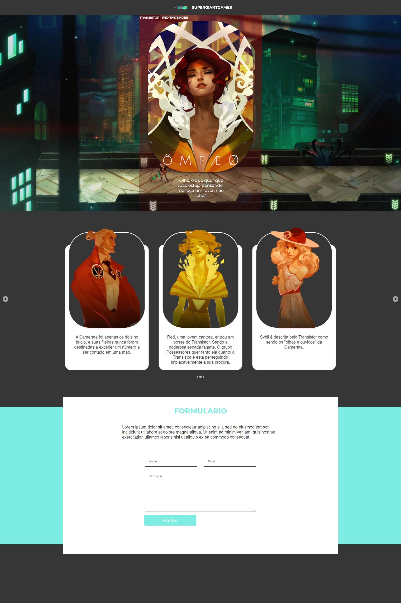
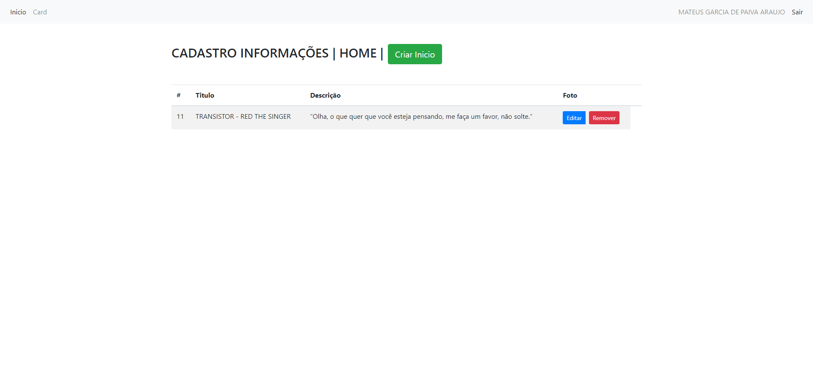
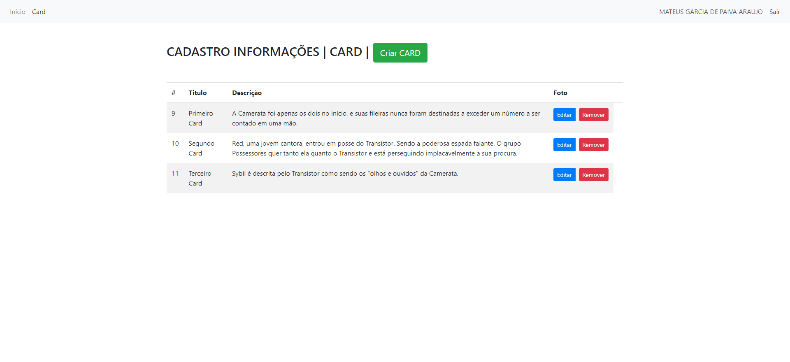

## 🎨 Cards Game CMS|  É um cms que usa Laravel na sua contrução

Vamos lá segue a instrução para rodar o projeto Localmente:

- Primeira coisa que vamos fazer é clonar o repositório 

```
git@github.com:mateuszao/cards-games-cms.git
```

- Com o repositório clonado nos vamos precisar rodar alguns comandos para baixar as dependências e pacotes 
- Na sua maquina é necessário ter o composer instalado que é o gerenciador de pacotes do PHP
- Caso não tenha é só instalar 

```
https://getcomposer.org/download/
```

- Também vamos precisar do Npm que vem com o Node.js

```
https://nodejs.org/en/download/
```

- Logo depois de baixar vamos rodar o comando para instalar as dependências 

```
composer install
```

- Depois que o comando rodar vamos precisar ir no arquivo .env para configurar o banco de dados
- Feito isso precisamos agora rodar nossas migrations e Seeders

```
php artisan migrate
```

```
php artisan db:seed
```

- Feito isso nossa base já vai estar configurada e você vai precisar rodar o comando para iniciar o servidor Laravel

```
php artissan serve
```

Que vai cair na home do nosso site já com os campos certinhos pois como criamos a seed e migrations tudo esta sendo referenciadas com o que colocamos no banco



## 👨‍💻💾 Para acessar a parte de Admin:

Para acessar o admin temos que ir na url e digitar:

```
register/

//A um exemplo usando a url local fica:
http://127.0.0.1:8000/register/
```

Para logar é só ir na rota e digitar:

```
login/

//A um exemplo usando a url local fica:
http://127.0.0.1:8000/login/
```

Depois você já cai no Painel de admin onde pode editar os dados necessários tanto da pagina inicial quando da parte dos Cards: 



Ou parte dos cards


